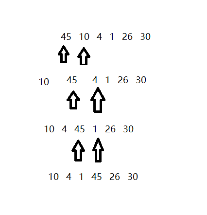
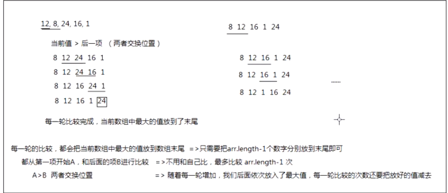

## 冒泡排序
冒泡排序是一个稳定的排序方法，其在最坏的情况下时间复杂度为O(N^2)，最好的情况下为O(N)，平均时间复杂度为O(N^2)

### 算法思路
冒泡排序的基本思路：假设有N个数，进行N-1轮比较：从第一项开始两两比较，如果前一项大于后一项就交换位置，直至所有的都比较一遍。



``` js
  let arr = [45, 10, 4, 1, 26, 30]
  Array.prototype.bubbleSort = function() {
    let arr = Array.prototype.slice.call(this)
    for(let i = 0; i < arr.length - 1; i++) {
      for(let j = 0; j < arr.length - 1 - i; j++) {
        if(arr[j] > arr[j + 1]) {
          // 交换数值
          [arr[j], arr[j + 1]] = [arr[j + 1], arr[j]]
        }
      }
    }
    return arr
  }
  console.log(arr.bubbleSort())
```
### 可以优化的点
如果是一个有序的数列，在进行冒泡排序时还要经过每一项和他的后面一项进行对比这是没有必要的，也就是说只要没有数值进行交换就说明已经排好序了
``` js
  let arr=[3,44,38,5,47,15,36,26,27,2,46,4,19,50,48]
  Array.prototype.bubbleSort = function() {
    let arr = Array.prototype.slice.call(this)
    
    for(let i = 0; i < arr.length - 1; i++) {
      let flag = true     // 默认为true，说明已经排序好了
      for(let j = 0; j < arr.length - 1 - i; j++) {
        if(arr[j] > arr[j + 1]) {
          // 只要交换数值就说明没排好
          [arr[j], arr[j + 1]] = [arr[j + 1], arr[j]]
          flag = false
        }
      }
      // 判断是否排好
      if(flag) break
    }
    return arr
  }
  console.log(arr.bubbleSort())
```