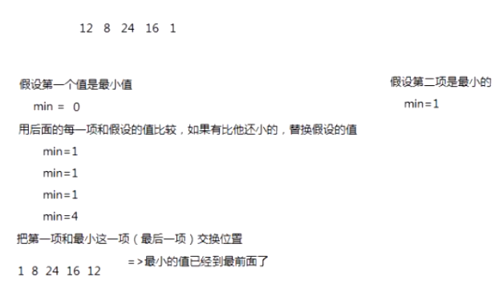

## 选择排序
选择排序是一种不稳定的排序方法，其在最坏的情况下时间复杂度为O(N^2)，最好的情况下为O(N^2)，平均时间复杂度为O(N^2)

### 算法思路
选择排序的基本思路：首先在未排序的数据中找出最小(大)的数放到数组的开头(末尾)，然后再从未排序的数据中找出找出最小(大)的数放到数组的开头(末尾)，直至数据完全有序



``` js
  let arr=[3,44,38,5,47,15,36,26,27,2,46,4,19,50,48]
  Array.prototype.selectSort = function() {
    let arr = Array.prototype.slice.call(this)
    for(let i = 0; i < arr.length - 1; i++) {
      // 假设当前（i之前的是已经排好序的了）i的下标的值是最小的
      let minIndex = i
      for(let j = minIndex + 1; j < arr.length; j++) {
        // 跟后面未排序的一次比较，若假设下标的值大于后面的值则将值小的下标赋值给minIndex
        if(arr[minIndex] > arr[j]) {
          minIndex = j
        }
      }
      // 交换数值
      [arr[i], arr[minIndex]] = [arr[minIndex], arr[i]]
    }
    return arr
  }
  console.log(arr.selectSort())
```
