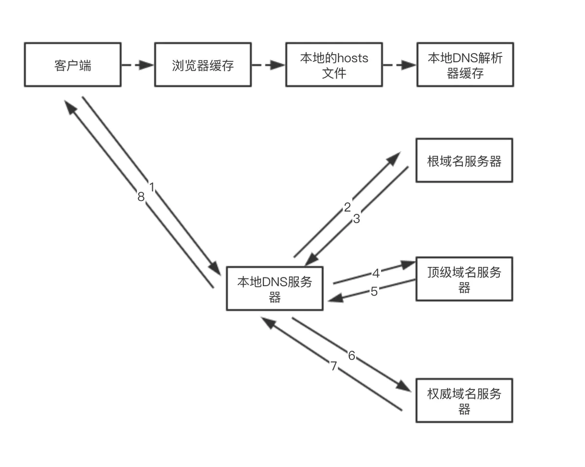

<!-- ## 在浏览器输入URL到页面呈现发生了什么 -->
### 网络篇
首先要了解现代浏览器都是多进程的浏览器，具体可分为主进程、网络进程、渲染进程(浏览器内核)、第三方插件进程等，在浏览器地址栏中输入要访问的网站域名后，首先通过网络进程发出网络请求，由于输入的是一个域名所以先要将域名解析成IP地址。
> 渲染进程内的线程包括：GUI渲染线程、js引擎线程、事件触发线程、定时器触发线程、异步http触发线程、合成线程
### DNS解析
人们很容易记得网站的名字，却很难记得网站的IP地址，所以就需要有一台服务器专门来做域名跟IP地址之间的映射，这种服务器就叫做DNS服务器。DNS服务器按照其层次可划分为根DNS服务器、顶级DNS服务器、权威DNS服务器，本地DNS服务器。除了这些我们本地浏览器和操作系统也会对查询过的域名进行缓存，当再次查询时可直接从缓存中查找。

DNS查询两种查询方式一种是递归查询、一种是迭代查询。在本地浏览器和本地DNS服务器之间使用的是递归查询，在本地DNS服务器和根DNS服务器之间使用迭代查询。

* DNS存在着多级缓存，从离浏览器的距离排序的话，有以下几种: 浏览器缓存，系统缓存，路由器缓存，IPS服务器缓存，根域名服务器缓存，顶级域名服务器缓存，主域名服务器缓存。
* 在域名和 IP 的映射过程中，给了应用基于域名做负载均衡的机会，可以是简单的负载均衡，也可以根据地址和运营商做全局的负载均衡。


> 根域名服务器的IP地址一般不会发生变化并且都是内置在服务器里的所以可以直接查询根域名服务器，全球主根DNS服务器共有十三台

### 建立TCP连接
#### HTTP 0.9 
* 只有一个请求行没有请求头和请求体。
* 服务器没有返回头信息，不需要告诉浏览器太多信息，只返回内容。
* 对于请求的文件都是以ASCII字符流的形式发送给客户端。
#### HTTP 1.0
* 引入的缓存的机制，增加了请求头和请求体
* 支持多种文件类型，通过请求头来和响应头来协商服务器需要的数据类型(content-type)和客户端需要的返回类型(accept)、以及压缩方式等。
* 引入了HTTP状态码机制及用户代理字段
### HTTP 1.1
* 引入了持久连接（长连接），一个TCP连接可传输多个HTTP请求，减少了建立和关闭连接的消耗和延迟，但都是串行的。
* 目前浏览器中每个域名最多可建立6个TCP连接（不同浏览器可能会不同）
* 不成熟的HTTP管线化：持久连接虽然能减少断开重连的次数，但是他的每个HTTP请求都是串行的也就是说一个请求发出去服务器响应后才能发送后一个请求。管线化的机制就是多个HTTP请求*整批*提交给服务器，然后服务器*根据顺序*依次返回响应。FireFox、Chrome都做过管线化的试验，但是由于各种原因，它们最终都放弃了管线化技术。
* 提供虚拟主机的支持：在HTTP/1.0中，每个域名绑定了一个唯一的IP地址，因此一个服务器只能支持一个域名。但是随着虚拟主机技术的发展，需要实现在一台物理主机上绑定多个虚拟主机，每个虚拟主机都有自己的单独的域名，这些单独的域名都公用同一个IP地址。因此，HTTP/1.1的请求头中增加了Host字段，用来表示当前的域名地址，这样服务器就可以根据不同的Host值做不同的处理。
* 对动态生成的内容提供了完美支持：在设计HTTP/1.0时，需要在响应头中设置完整的数据大小，如Content-Length: 901，这样浏览器就可 以根据设置的数据大小来接收数据。不过随着服务器端的技术发展，很多⻚面的内容都是动态生成的，因此在传输数据之前并不知道最终的数据大小，这就导致了浏览器不知道何时会接收完所有的文件数据。
HTTP/1.1通过引入Chunk transfer机制来解决这个问题，服务器会将数据分割成若干个任意大小的数据 块，每个数据块发送时会附上上个数据块的⻓度，最后使用一个零⻓度的块作为发送数据完成的标志。这样 就提供了对动态内容的支持。
* 客戶端Cookie、安全机制
### HTTP 2.0
* 改进的多路复用，一个域名只使用一个TCP连接，但是以串行传输
* 服务器推送
* header压缩

TCP的建立需要经历三个步骤（三次握手）

> 为什么要三次握手, 两次不可以吗?
>A:试想一下, A第一次发送请求连接, 但是在网络某节点滞留了, A超时重传, 然后这一次一切正常, A跟B就愉快地进行数据传输了. 等到连接释放了以后, 那个迷失了的连接请求突然到了B那, 如果是两次握手的话, B发送确认, 它们就算是建立起了连接了. 事实上A并不会理会这个确认, 因为我压根没有要传数据啊. 但是B却傻傻地以为有数据要来, 苦苦等待. 结果就是造成资源的浪费.

### 发送HTTP请求
通过TCP建立连接之后浏览器就可以跟服务器进行通信了，即发送HTTP请求，浏览器发送的HTTP请求包括请求头，请求行和请求体。

首先，浏览器会向服务器发送请求行，请求行格式:
``` js
// 请求方法是GET，路径为根路径，HTTP协议版本为1.1
GET / HTTP/1.1
```
其结构包含请求方法、请求路径、使用协议。

同时也要带上请求头，关于缓存的相关信息比如Cache-Control、If-Modified-Since、If-None-Match都由可能被放入请求头中。
``` 
Accept: text/html,application/xhtml+xml,application/xml;q=0.9,image/webp,image/apng,*/*;q=0.8,application/signed-exchange;v=b3
Accept-Encoding: gzip, deflate, br
Accept-Language: zh-CN,zh;q=0.9
Cache-Control: no-cache
Connection: keep-alive
Cookie: /* 省略cookie信息 */
Host: www.baidu.com
Pragma: no-cache
Upgrade-Insecure-Requests: 1
User-Agent: Mozilla/5.0 (iPhone; CPU iPhone OS 11_0 like Mac OS X) AppleWebKit/604.1.38 (KHTML, like Gecko) Version/11.0 Mobile/15A372 Safari/604.1
```
最后是请求体，请求体只有在POST方法下存在，常见的场景是表单提交。
### 缓存
缓存优先级：Service Worker、Memory Cache、Disk Cache、Push Cache
强缓存、协商缓存
### 网络响应
HTTP请求到达服务器后经过服务器处理返回相应的响应信息
跟请求信息类似，响应信息包含：响应头、响应行、响应体。
响应行对应格式：
```js
HTTP/1.1 200 OK
```
其结构包含HTTP协议版本、状态码和状态描述组成。

响应头包含了服务器及其返回数据的一些信息, 服务器生成数据的时间、返回的数据类型以及对即将写入的Cookie信息。
```
Cache-Control: no-cache
Connection: keep-alive
Content-Encoding: gzip
Content-Type: text/html;charset=utf-8
Date: Wed, 04 Dec 2019 12:29:13 GMT
Server: apache
Set-Cookie: rsv_i=f9a0SIItKqzv7kqgAAgphbGyRts3RwTg%2FLyU3Y5Eh5LwyfOOrAsvdezbay0QqkDqFZ0DfQXby4wXKT8Au8O7ZT9UuMsBq2k; path=/; domain=.baidu.com
```
响应体就是返回给客户端的数据了，可以是json、HTML文件、TXT文件等。
### 断开TCP连接

> Q : 为什么要四次挥手, 而不是两次, 三次?
>A :首先, 由于TCP的全双工通信, 双方都能作为数据发送方. A想要关闭连接, 必须要等数据都发送完毕, 才发送FIN给B. (此时A处于半关闭状态)然后, B发送确认ACK, 并且B此时如果要发送数据, 就发送(例如做一些释放前的处理)再者, B发送完数据之后, 发送FIN给A. (此时B处于半关闭状态)然后, A发送ACK, 进入TIME-WAIT状态,最后, 经过2MSL时间后没有收到B传来的报文, 则确定B收到了ACK了. (此时A, B才算是处于完全关闭状态)
> PS : 仔细分析以上步骤就知道为什么不能少于四次挥手了.
> Q : 为什么要等待2MSL(Maximum Segment Lifetime)时间, 才从TIME_WAIT到CLOSED？
>A : 在Client发送出最后的ACK回复，但该ACK可能丢失。Server如果没有收到ACK，将不断重复发送FIN片段。所以Client不能立即关闭，它必须确认Server接收到了该ACK。Client会在发送出ACK之后进入到TIME_WAIT状态。Client会设置一个计时器，等待2MSL的时间。如果在该时间内再次收到FIN，那么Client会重发ACK并再次等待2MSL。MSL指一个片段在网络中最大的存活时间，2MSL就是一个发送和一个回复所需的最大时间。如果直到2MSL，Client都没有再次收到FIN，那么Client推断ACK已经被成功接收，则结束TCP连接。

### 渲染篇
### DOM树的构建
⽹络进程接收到响应头之后，会根据响应头中的`content-type`字段来判断⽂件的类型，⽐如`contenttype`的值是`text/html`，那么浏览器就会判断这是⼀个 HTML 类型的⽂件，然后为该请求选择或 者创建⼀个渲染进程。渲染进程准备好之后，⽹络进程和渲染进程之间会建⽴⼀个共享数据的管道， ⽹络进程接收到数据后就往这个管道⾥⾯放，⽽渲染进程则从管道的另外⼀端不断地读取数据，并同 时将读取的数据“喂”给 HTML 解析器。你可以把这个管道想象成⼀个“⽔管”，⽹络进程接收到的 字节流像⽔⼀样倒进这个“⽔管”，⽽“⽔管”的另外⼀端是渲染进程的 HTML解析器，它会动态接收字节流，

当收到网络进程所传递的字节流后通过`词法解析`和`语法解析`(两者也合称为`分词器`)将其token化，然后开始通过token解析成`DOM节点`(HTMLParser)最后组成`DOM tree`。

在将token解析成`DOM节点`的时候HTML解析器会维护一个token栈结构，该token栈主要用来计算节点的父子关系，每当通过`分词器`生成token后就会按照顺序压入到这个栈中。
* 如果压入栈的是一个Start Token，HTML解析器就会为该token创建一个DOM节点，并添加到DOM树中，他的父节点就是相邻的那个元素生成的节点。
* 如果`分词器`解析出来的是一个文本token，那么他会生成一个文本节点，然后将该节点直接插入到`DOM树`中，文本token是不压入栈中的，他的父元素就是当前栈顶token所对应生成的`DOM节点`。
* 如果`分词器`解析出来的是一个End Token则会查看栈顶是否为所对应的的Start Token，如果是就将Start Token弹出栈，此DOM节点完成解析。


HTML解析器开始工作时，会默认创建一个根为document的空DOM结构


### CSSOM树的构建
当html文件中存在样式文件时在解析HTML生成`DOM树`的同时还会解析CSS生成`CSSOM树`。
> 渲染树是DOM树和CSSOM树组合形成的，所以CSS的解析不会影响DOM的解析，但会影响DOM的渲染。


可以看到在`DOM树`的构建和`CSSOM树`的构建是同时进行的。那为什么说CSS会影响DOM的渲染呢？

### JavaScript对DOM树和CSSOM树构建的影响
* 情况一：当页面中只有HTML和JavaScript时，并且JavaScript不是通过外部引入的时候，DOM树构建时遇到JS脚本就要暂停DOM树的解析，去执行JS代码，因为在JS中可能会有操作DOM的情况。不过JS只能操作已生成的DOM节点，对于那些还没生成的DOM节点不能进行操作。
``` html
 <html>
    <body>
      <div id="text1">text1</div>
      <script>
        let oDiv1 = document.getElementById('text1')
        oDiv1.innerHTML = 'test3'

        let oDiv2 = document.getElementById('text2')
        oDiv2.innerHTML = 'test4'
      </script>
      <div id="text2">text2</div>
    </body>
 </html>
```
id为text1的div节点的innerHTML会被执行的JS代码修改成text3，而id为text2的节点并不会受影响，因为在执行JS代码操作该节点时，还为解析到该节点。

* 情况二：当页面中只有HTML和JavaScript时，但是JS文件时通过外部引入的方式时，当DOM树的构建解析到script标签时，发现是外部引入的，则会暂停DOM的解析转去下载JS文件，当JS文件下载完成后并执行JS文件，所以当通过外部引入JS文件时JS的下载和执行都会阻塞DOM树的形成。
> 现代浏览器都会对这种情况进行优化，当渲染进程接收HTML文件字节流时，会预先开启一个预解析线程，⽤来分析 HTML ⽂件中包含的 JavaScript、CSS 等相关⽂件，解析到相关⽂件之后，预解析线程会提前下载这些⽂件。

* 情况三：当页面中有HTML、JavaScript和CSS文件，并且JS和CSS文件都不是通过外部引入的方式时，在DOM树的构建过程中解析到CSS文件开始构建CSSOM树，解析到JS文件时阻塞DOM的解析，执行JS文件，但是由于JS文件可能会操作CSS，所以在执行前先要判断CSSOM树是否解析完成，若没有解析完成则等待CSSOM树的完成(CSS的解析间接的影响DOM的解析)

* 情况四：当页面中有HTML、JavaScript和CSS文件，并且JS和CSS文件都是通过外部引入的方式时，由于浏览器的优化策略，在渲染进程接收到文件流时会开启一个预解析线程去下载JS和CSS文件，在构建DOM树时遇见JS文件则会跟情况二类型一样了


### 构建渲染树(布局树)

DOM树和CSSOM树都构建完成后浏览器就可以通过两者合成渲染树了。浏览器会从DOM树的根节点遍历每一个*可见*节点，然后对每个可见节点在CSSOM树中找到适配的CSS样式规则并应用。

注意事项
* Render树和DOM树是不完全一致的，渲染树中只包含了可见的节点，对于DOM树中的`head`标签、CSS属性`display: none`的节点不会出现在渲染树中。
* 请注意 visibility: hidden 与 display: none 是不一样的。前者隐藏元素，但是依然占据着布局空间（即将其渲染成一个空框），而后者则会在渲染树中完全移除。

### 形成分层树

渲染引擎会为特定的节点生层专用的图层，并生成一颗对应的分层树(LayerTree)

不是渲染树的每个节点都会有一个图层，如果一个节点没有对应的图层则会隶属于父节点的图层

### 分块、光栅化

绘制列表只是用来记录绘制顺序和绘制指令的列表，而实际上绘制操作是由渲染进程的合成线程来完成的。合成线程会将图层划分为图块(tile)，合成线程会按照视口附近的图块来优先生成位图，实际生成位图的操作是由栅格化来执行的。所谓栅格化就是将图块转化为位图。

### 合成显示

当所有的图块都被光栅化之后，合成线程就会生成一个绘制图块的命令“DrawQuad”，然后将该命令
提交给浏览器进程。浏览器进程⾥⾯有⼀个叫 viz 的组件，⽤来接收合成线程发过来的 DrawQuad 命
令，然后根据 DrawQuad 命令，将其⻚⾯内容绘制到内存中，最后再将内存显⽰在屏幕上。


1. 渲染进程将 HTML 内容转换为能够读懂的 DOM 树结构。
2. 渲染引擎将 CSS 样式表转化为浏览器可以理解的 styleSheets，计算出 DOM 节点的样式。
3. 创建布局树，并计算元素的布局信息。
4. 对渲染树进⾏分层，并⽣成分层树。
5. 为每个图层⽣成绘制列表，并将其提交到合成线程。
6. 合成线程将图层分成图块，并在光栅化线程池中将图块转换成位图。
7. 合成线程发送绘制图块命令 DrawQuad 给浏览器进程。
8. 浏览器进程根据 DrawQuad 消息⽣成⻚⾯，并显⽰到显⽰器上。


### 优化

* 页面结构上CSS资源要比JS资源优先引入，样式文件应当放入`head`标签中，JS文件放到`body`的最下方，这样可以防止阻塞。
* 减少在JS中的DOM操作
* 简化并优化CSS选择器，尽量将嵌套层减至最少
* 减少回流和重绘
* 使⽤ CDN 来加速 JavaScript ⽂件的加载，压缩 JavaScript ⽂件的体积
* 在引入外部JS文件时可使用async或defer属性


### 参考
* 阮一峰 - DNS 原理入门<http://www.ruanyifeng.com/blog/2016/06/dns.html>
* winty - 细说浏览器输入URL后发生了什么<https://juejin.im/post/5e32449d6fb9a02fe4581907>
* Thehärder&theluckÏer♚- http发展史(http0.9、http1.0、http1.1、http2、http3)梳理笔记<https://juejin.im/post/5dbe8eba5188254fe019dabb#heading-10>
* 神三元 - (1.6w字)浏览器灵魂之问，请问你能接得住几个？<https://juejin.im/post/5df5bcea6fb9a016091def69#heading-24>
* 京程一灯-三步带你吃透浏览器原理

