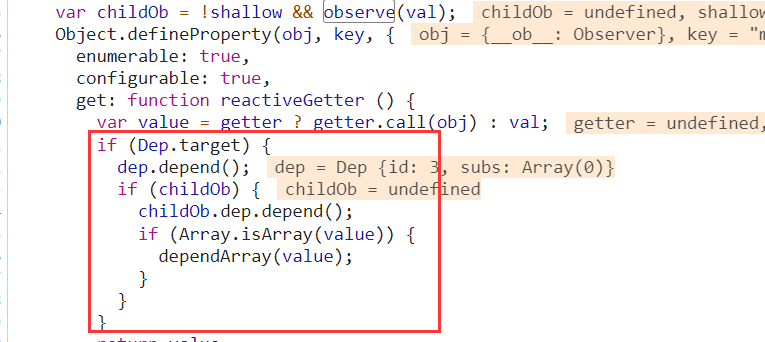
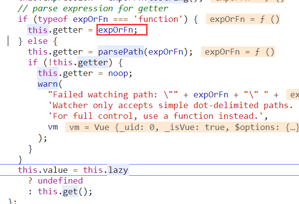
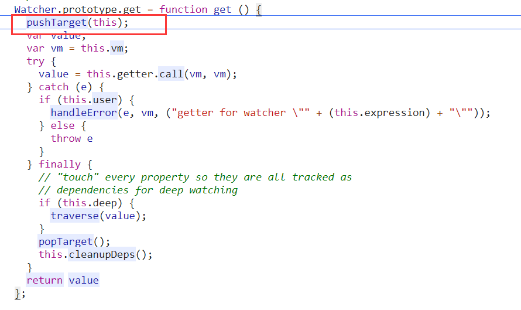

* Vue有了数据劫持为什么还要DOM diff？这不是多此一举嘛。

1.vue在对数据进行劫持时会保存应用到该数据的Wechater，Wechater分为渲染watcher（一般为组件）、computedWatcher和userWechaer（即用户自定义的watch），当数据发成变更时，vue也就知道要更新哪个watcher，当更新的是一个渲染Watcher时就知道是哪个组件要进行更新，所以只需要对该组件中的DOM进行Diff即可，即vue的更新粒度是组件级别的，如果在组件中应用了computed或者watch也就是该渲染Watcher依赖于computedWatcher和userWatcher，最后也会更新渲染Watcher然后进行DOM diff。

可以看到在做数据劫持时会判断`Dep.target`这个变量有没有值，如果有值会执行`dep.depend()`方法，而这个`Dep.target`其实指向的是一个Watcher对象

在组件挂载时会先创建一个Watcher对象，而这个Watcher对象是一个渲染watcher，他的`getter`会赋值为`updateComponent`而在`updateComponent`中也就是会重新执行`_render`函数生成`vnode`然后在调用`_update`方法更新视图，紧接着会执行watcher的`get`方法，在get方法中会先执行`pushTarget`方法并且把`this`（渲染watcher）传进去，在`pushTarget`函数中会把`Dep.target`赋值为该渲染watcher。在调用`_render`的过程中由于使用到了被劫持的数据所以会走到该数据的`getter`访问器属性中，然后会判断`Dep.target`，然后执行`dep.depend()`，`depend`方法会调用`Dep.target.addDep(this)`，`Dep.target`就是watcher，相当于执行`watcher.addDep`在addDep中会先判断有`newDepIds`中没有这个`dep`如果有就忽略，没有的话就添加到`newDepIds`、`newDeps`列表中，最后在判断`depIds`中有没有该`dep`如果没有就会把`watcher`添加到`dep`的`subs`列表中。

其实上面这一系列就是建立`Watcher`和`Dep`的关系，也就是建立数据跟Watcher的关系，然后在数据更新时触发`setter`访问器属性，执行`dep.notify()`，在`notify`方法中会遍历之前添加到`subs`中的`Watcher`对象，并调用`Watcher`对象的`update`方法进行更新，最后会在执行`Watcher`的`get`方法，进行视图更新。

