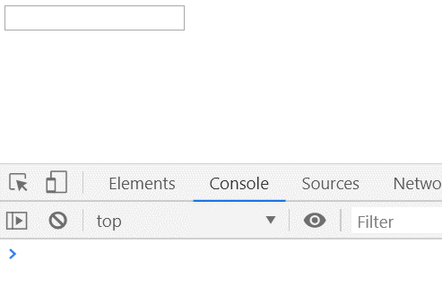
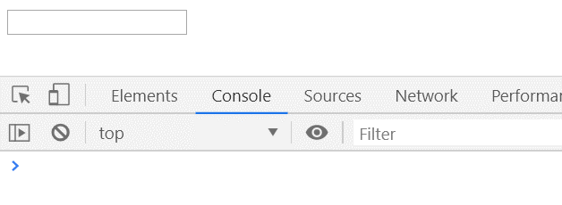
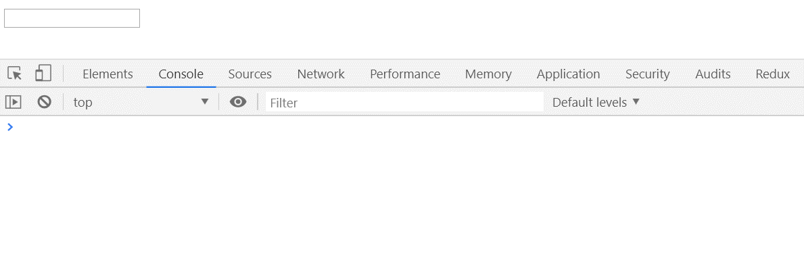
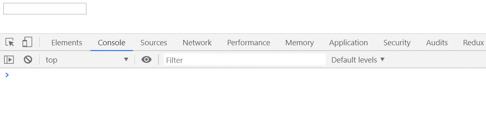
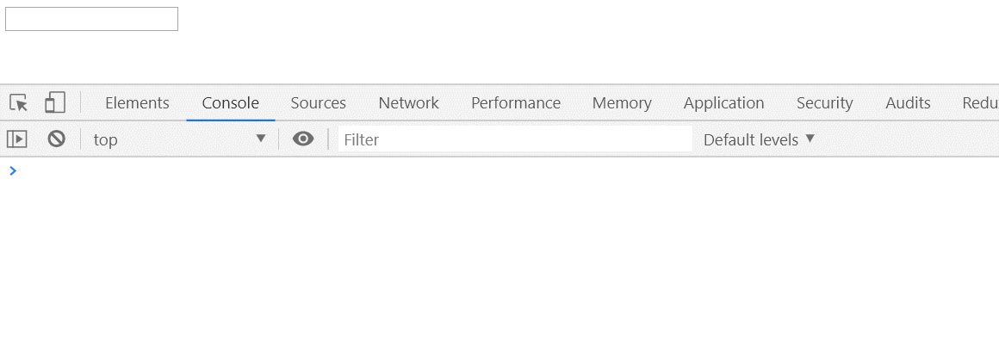

## 防抖
  ### 概念
  防抖就是在事件被触发的n秒后再执行回调函数，如果在等待的这n秒内再次触发该事件则重新计时。
  ### 生活中的例子
  就像坐电梯，你按铃上去之后（触发事件）等着电梯关门（延迟时间）然后开始走（运行），正当电梯快要关门时突然又来了一个人也按了铃上来了，然后电梯又得等待一段时间才能关门，若在这个等待过程中一直有人按铃进来（重复触发事件）则电梯会一直等待下去不会直接运行往上走。
  ### 代码示例
  ``` html
    <input type="text" id="input" />
  ```
  ``` js
    function getData() {
      console.log('getData')
    }
    const oInput = document.querySelector('#input')
    oInput.addEventListener('input', getData)
  ```
  

  没加防抖之前可以看到当我们每次输入都会触发`getData`函数执行。
  ### 实现防抖函数
  我们先来实现一个简单防抖函数并应用在当前的这个例子上看一下
  ``` js
    // 新增防抖函数 
    function debounce(func, delay) {
      let timer = null
      return function () {
        if(timer) {
          clearTimeout(timer)
        }
        timer = setTimeout(() => {
          func()
        }, delay)
      }
    }
    // 调用防抖函数并设置延迟时间为1000
    oInput.addEventListener('input', debounce(getData, 1000))
  ```
  

  可以看到加入防抖函数之后当在输入框输入一秒钟后才执行`getData`函数，并且如果在这一秒钟的等待时间内再次触发了`input`事件则会重新开始计时。

  ### 改进版一
  上面我们实现了一个简单的防抖函数，但如果我们想给这个防抖之后的函数传一些参数要怎么做呢？

  ``` js
    function getData(e) {           // 修改
      console.log('getData')
      console.log(e)                // 新增
    }
    function debounce(func, delay) {
      let timer = null
      return function (...args) {   // 修改
        if(timer) {
          clearTimeout(timer)
        }
        timer = setTimeout(() => {
          func(...args)             // 修改
        }, delay)
      }
    }
    oInput.addEventListener('input', debounce(getData, 1000))   // 修改
  ```
  

  我们使用ES6的扩展运算符在将函数的参数转换为一个数组，然后在函数调用时使用展开运算符将数组展开并将参数传递给函数，可以看到在控制台中打印出了我们传递过去的事件对象。

  ### 改进版二

  还有一个我们我们没有注意到，什么问题呢？我们来看看没使用防抖前函数的`this`指向谁。
  ``` js
    function getData() {
      console.log('getData')
      console.log(this)         // 指向触发input事件的那个input输入框
    }


    const func = debounce(getData, 1000)
    oInput.addEventListener('input', (e) => func(e))
    function getData(e) {
      console.log('getData')
      console.log(e)
      console.log(this)         // this指向丢失，默认绑定到window对象
    }
  ```
  可以看到当我们没使用防抖前`getData`事件处理函数的`this`指向`input`输入框，使用了防抖后`this`却指向了`window`。
  这是因为我们调用`debounce`函数后返回的防抖后的函数`this`发生了丢失，然后默认绑定到了`window`对象上。
  ``` js
    function debounce(func, delay) {
      let timer = null
      return function (...args) {   // 修改
        if(timer) {
          clearTimeout(timer)
        }
        timer = setTimeout(() => {
          func.call(this, ...args)             // 修改
        }, delay)
      }
    }
  ```
  我们在真正的函数执行时使用`call`显式绑定`this`的值，这样就不会发生`this`指向丢失的问题了。
  
  ### 改进版三
  假设我们想要这个函数绑定后先立即执行一次，然后等到停止触发 n 秒后，才可以重新触发执行。
  ``` js
   function debounce(func, delay, immediate) {    // 新增immediate
      let callNow = immediate                     // 新增
      let timer = null
      return function (...args) { 
        if(callNow) {                             // 新增
          func.call(this, ...args)
          callNow = false
        } else {
          if(timer) {
            clearTimeout(timer)
          }
          timer = setTimeout(() => {
            func.call(this, ...args)
          }, delay)
        }
      }
    }
    oInput.addEventListener('input', debounce(getData, 2000, true))
  ```
  

