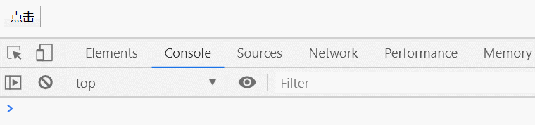
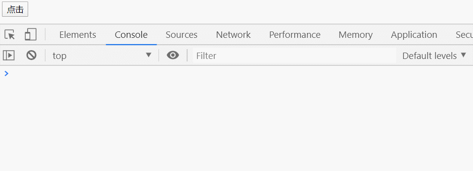
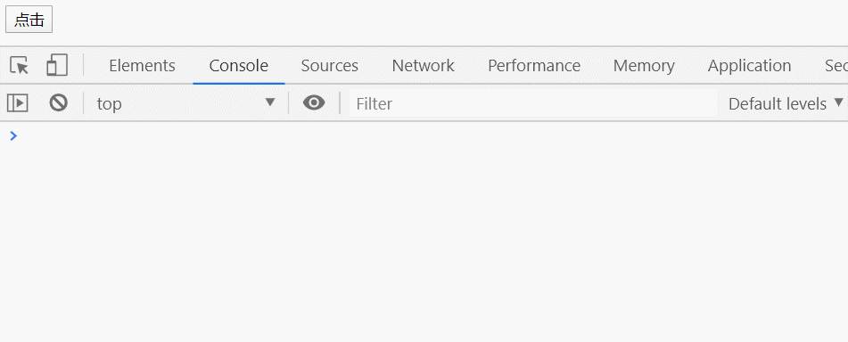
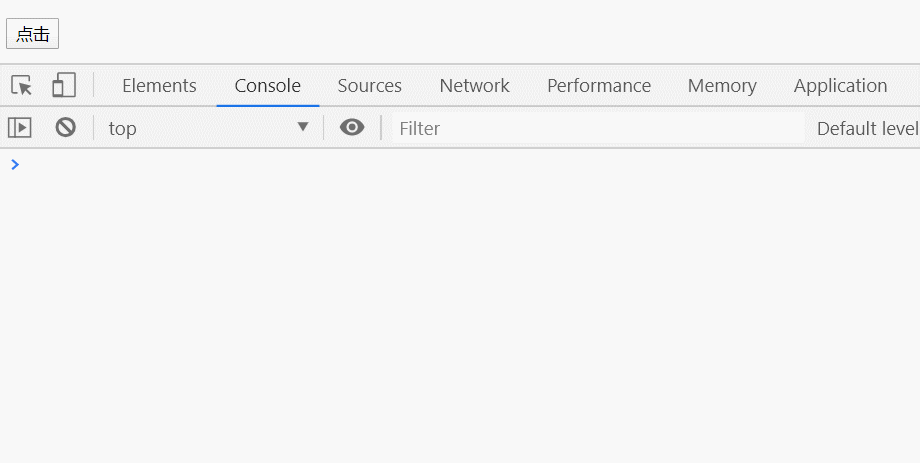

## 节流
  ### 概念
  节流就是当某个事件持续触发时，隔n秒才能执行事件处理函数。
  ### 生活中的例子
  节流最常见的例子就是玩游戏的技能冷却，你放了一个技能后进入冷却时间，在其间无论再怎么按也不会触发，当冷却完成后才能再次触发。
  ### 代码示例
  ``` html
    <button id="btn" >点击</button>
  ```
  ``` js
    function handleClick() {
      console.log('点击了')
    }
    const oBtn = document.querySelector('#btn')
    oBtn.addEventListener('click', handleClick)
  ```
  

  没加节流之前可以看到当我们点击按钮时都会触发`handleClick`函数的执行。

  ### 使用时间戳实现节流函数
  节流的原理就是当你在一段时间内连续触发事件时他会限制执行事件处理函数的次数，每隔一段时间，只执行一次事件处理函数。
  ``` js
    function throttle(func, delay) {
      let prev = new Date()
      return function () {
        let now = new Date()
        if(now - prev > delay) {
          func()
          prev = new Date()
        }
      }
    }
    // 调用防抖函数并设置延迟时间为1000
    oBtn.addEventListener('chilck', throttle(handleClick, 2000))
  ```
  
  
  可以看到加入节流后当我们持续点击按钮时他的事件处理函数每隔两秒钟才会执行一次，当你在这两秒钟之内重复点击时他是不会执行处理函数的。

  ### 传递参数，this指向
  上面我们使用时间戳的方式实现了一个简单的节流函数，但节流之后的函数我们并不能给他传参，而且节流之后他的`this`指向也出现了问题。下面我们来修复一下这两个问题。
  ``` js
    function handleClick(e) {        // 修改
      console.log('点击了')
      console.log(e)                 // 新增
      console.log(this)              // 新增
    }
    function throttle(func, delay) {
      let prev = new Date()
      return function (...args) {          // 修改
        let now = new Date()
        if(now - prev > delay) {
          func.apply(args)                 // 修改
          prev = new Date()
        }
      }
    }
    oBtn.addEventListener('click', throttle(handleClick, 2000))    // 修改
  ```
  
  ### 用定时器实现
  除了用时间戳可以实现节流还可以使用定时器来实现。
  ``` js
    function throttle(func, delay) {
      let timer = null
      return function (...args) {
        if(!timer) {
          timer = setTimeout(() => {
            timer = null
            func.apply(this, args)
          }, delay)
        }
      }
    }
  ```
  当点击触发事件的时候，我们设置一个定时器，再次触发事件的时候，如果定时器存在，就不执行，直到定时器执行，然后执行函数，清空定时器，这样就可以设置下个定时器。
  
  可以看到这样用定时器实现和之前用时间戳实现有一点区别:用时间戳实现的节流函数当第一次点击时会立即先执行一次，然后在一段时间内多次触发的不会执行，而用定时器实现的节流在第一次点击时不会立即执行，而是先等一段时间（在此期间内触发的不会执行），然后在执行，当停止触发事件后最后在执行一次事件处理函数。

  ### 升级版
  综合上面两个的优点我们是否可以写一个第一次点击立即执行，然后停止触发的时候能在执行一次。
  ``` js
    function throttle(func, delay) {
      let timer = null, prev = 0
      return function (...args) {
        let now = +new Date()
        let remaining = delay - (now - prev)
        // 第一次触发
        if(remaining <= 0 || remaining > delay) {
          if(timer) {
            clearTimeout(timer)
            timer = null
          }
          prev = now
          func.apply(this, args)
        } else if(!timer) {
          timer = setTimeout(() => {
            prev = +new Date()
            timer = null
            func.apply(this, args)
          }, delay)
        }
      }
    }
  ```
  
  当点我们第一次点击时他会立即触发一次，然后我们在等待期间继续点击他并没触发函数执行，但当我们最后一次点击等待一段延迟时间后再次执行。
  


