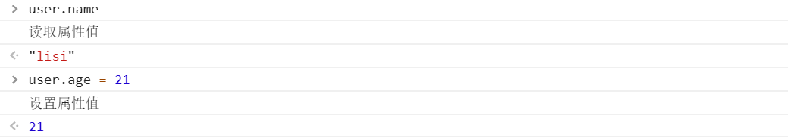
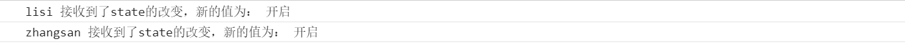

## Vue响应式原理

  vue的响应式原理主要通过ES5的```Object.defineProperty```来对数据进行拦截，通过观察者模式在数据```get```的时候收集依赖，然后在```set```的时候触发依赖更新。

  ### Object.defineProperty

  Object.defineProperty是一个ES5的语法，他可以为js对象添加数据属性（Configurable、Enumerable、Writable、Value）和访问器属性（get、set）我们先来看下他的使用方式。

  首先定义一个js对象
  ```let user = { name: 'lisi', age: 19 }```通常我们想要访问对象上的某个属性直接可以用```对象名.属性```的方式访问就可以了。但我们要是想要在读取某个属性或设置某个属性时进行一些别的操作那么该怎么做呢？

  这时候我们就可以用```Object.defineProperty```来包装一下这个对象。
  ``` js
  let user = { name: 'lisi', age: 19 }
  for(let key in user) {
    let val = user[key]
    if(user.hasOwnProperty(key)) {        // forin会遍历原型上的属性所以我们要把原型上的属性给过滤掉
      Object.defineProperty(user, key, {
        get() {
          console.log('读取属性值')
          return val
        },
        set(value) {
          console.log('设置属性值')
          val = value
        }
      })
    }
  }
  ```
  首先我们使用```for in```遍历整个对象通过```Object.defineProperty```给对象的每个属性增加```get``` ```set```访问器属性，现在当我们再次读取对象上的任意属性时就会在控制台中打印“读取属性值”，为对象属性设置新的值时就会打印“设置对象属性”。

  

  ### 观察者模式

  观察者模式是一种行为型的设计模式，它定义了一种一对多的依赖关系，即当一个对象的状态发生改变的时候，所有依赖于它的对象都会得到通知并自动更新，解决了主体对象与观察者之间功能的耦合。

  > 发布-订阅设计模式是一种特殊的观察者模式，他和观察者模式的主要区别在于发布-订阅模式有一个调度中心，由这个调度中心管理着事件的订阅和分发，也就是说发布-订阅模式中的发布者和订阅者没有直接的关系，他们是靠这个调度中心来联系

  这里我们先实现一个简易的观察者模式

  ``` js
    // 观察者
    class Observe {
      constructor(name) {
        this.name = name
      }
      update(state) {
        console.log(this.name, '接收到了state的改变，新的值为：', state)
      }
    }
    // 被观察者
    class Subscribe {
      constructor(state) {
        this.state = state
        this.subs = []
      }
      addSub(sub) {
        // 建立观察者跟被观察者的联系
        this.subs.push(sub)
      }
      removeSub(sub) {
        let index = this.subs.findIndex((item) => item === sub)
        return this.subs.splice(index, 1)
      }
      setState(newState) {
        this.state = newState
        this.notify(newState)
      }
      notify(newState) {
        // 依次通知观察者更新状态
        this.subs.forEach((sub) => {
          sub.update(newState)
        })
      }
    }
  ```

  ``` js
    // 创建观察者对象
    const ob1 = new Observe('lisi')
    const ob2 = new Observe('zhangsan')
    // 创建被观察者对象，并初始化状态
    const sub = new Subscribe('关闭')
    // 将观察者添加到被观察者的通知列表里面
    sub.addSub(ob1)
    sub.addSub(ob2)
    // 更新状态
    sub.setState('开启')
  ```

  

  上面我们创建了一个简单的观察者模式，首先将被观察者将观察者添加到自己的通知列表里面，当自己的状态发生改变时依次通知观察者更新状态。

  ### Vue2中的数据响应式处理

  在组件的初始化阶段，将对传入的状态进行初始化，以下以data为例，会将传入的数据包装为响应式的数据。
  ``` js
    new Vue({
      el: 'app',
      data: {
        name: 'lisi'
      }
    })
  ```
  上面我们大体介绍vue实现响应式原理的方法，那么我们现在仿照源码写一个demo来理解vue中对象的响应式处理.
  ``` js 
    function isObject(obj) {
      return typeof obj === 'object' && obj !== null
    }
    function observer(data) {
      if(!isObject(data)) {
        return data
      }
      let keys = Object.keys(data)
      keys.forEach((key) => {
        defineReactive(data, key, data[key])
      })
    }

    function defineReactive(target, key, val) {
      Object.defineProperty(target, key, {
        get() {
          return val
        },
        set(value) {
          if(value !== val) {
            val = value
            console.log('触发更新')
          }
        }
      })
    }
  ```
  ``` js
    let data = {
      name: 'lisi',
      user: {
        userName: '001',
        sex: '男'
      }
    }
    // 对数据进行拦截
    observer(data) 
    data.name = '小明'    // 触发更新
    data.user.sex = '女'  // 不会触发更新
  ```
  **问题一：当我们修改data对象中的第一层数据时会触发更新，但是如果我们修改的是更深层次的对象属性那么他是监测不到的**，导致出现这个问题的关键就是我们只对data对象的第一层做了数据拦截，那么我们可以对data中的数据判断一下，如果还是一个对象则继续向下拦截，也就是用要做递归拦截。

  ``` js 2
    function defineReactive(target, key, val) {
      observer(val)  // 新加
      Object.defineProperty(target, key, {
        get() {
          return val
        },
        set(value) {
          if(value !== val) {
            val = value
            console.log('触发更新')
          }
        }
      })
    }
  ```
  现在我们来看一下是否能正确的触发更新
  ``` js 
   data.user.sex = '女'  // 触发更新
  ```
  **问题二：如果我们直接赋值给user一个新对象，然后再修改user对象中的属性，他也是不能触发更新的**
  ``` js
    data.user = {       // 触发更新
      userName: '002',
      sex: '男',
      skill: ['吃饭', '睡觉']
    }
    data.user.userName = '003' // 不会触发更新
  ```
  这个问题的主要原因是在赋值时我们没有对这个新赋的值做数据拦截
  ``` js
    function defineReactive(target, key, val) {
      observer(val)
      Object.defineProperty(target, key, {
        get() {
          return val
        },
        set(value) {
          if(value !== val) {
            observer(value)      // 新加
            val = value
            console.log('触发更新')
          }
        }
      })
    }
    data.user.userName = '003' // 触发更新
  ```
  **问题三：对数组的数据响应式支持。**
  大家都知道vue不光可以处理对象的数据响应式还能处理数组的数据响应式，但是要通过使用指定的方法(pop, push, shift, unshift, splice...)
  > 其实Object.defineProperty可以实现对数组的拦截但是为什么vue没有做呢？
  >
  > 性能代价和获得的用户体验收益不成正比。（尤大原话）详情见issues <https://github.com/vuejs/vue/issues/8562>
  ``` js
    const arrayMethods = ['pop', 'push', 'shift', 'unshift', 'splice', 'sort', 'reverse']
    const oldPrototype = Array.prototype
    const proto = Object.create(oldPrototype)
    arrayMethods.forEach((method) => {
      proto[method] = function (...args) {          // 函数劫持将原有的函数进行重写，
        updateView()                                // AOP
        oldPrototype[method].call(this, ...args)
      }
    })
    function updateView() {
      console.log('触发更新')
    }
    function observer(data) {
      if(!isObject(data)) {
        return data
      }
      if(Array.isArray(data)) {
        // 对数组的处理
        Object.setPrototypeOf(data, proto)
        for(let i = 0; i < data.length; i++){
          observer(data[i]);
        }
      } else {
        // 对对象的处理
        let keys = Object.keys(data)
        keys.forEach((key) => {
          defineReactive(data, key, data[key])
        })
      }
    }
    data.user.skill.push('撸代码')        // 触发更新
  ```
  vue中使用了观察者模式，那么观察者模式是怎么应用的呢？

  我们在写vue的时候经常会这样写
  ``` html
    <template>
      <p>{{name}}</p>
    </template>
  ```
  或者
  ``` js
    vm.$watch('name', (newVal, oldVal) => {
      // do something
    })
  ```
  **问题一：谁是观察者，谁是被观察者？**
  首先我们先来回答第二个谁是被观察者，无论是在模板中用到的数据还是在watch用监听的数据当他们变化时就会触发更新，那么这些数据就相当于是被观察者。
  我们可能会写好多数据vue怎么解决的当某一个数据改变时只触发依赖于该数据的地方更新呢？

  在学习vue的过程中我们可能都会听说过这么一句话，**getter中，收集依赖，setter中，触发依赖。**
  收集依赖就是将用到某个数据的地方存起来，那么要存到哪呢？？

  思考一下，首先想到的是每个`name`都有一个数组，用来存储当前`name`的依赖，假设依赖是一个函数存在`window.target` 上，先把`defineReactive`稍微改造一下。
  ``` js
    function defineReactive(target, key, val) {
      let deps = []               // 新增
      observer(val)
      Object.defineProperty(target, key, {
        get() {
          deps.push(window.target)
          return val
        },
        set(value) {
          if(value !== val) {
            observer(value)
            deps.forEach((dep) => {       // 新增
              dep(value, val)
            })
            val = value
          }
        }
      })
    }
  ```
  在`defineReactive`中增加了一个数组用来存放被收集依赖。

  在`get`的时候依次触发依赖更新

  这样写有点耦合，我们把依赖收集这部分代码封装起来，写成下面的样子：
  ``` js
    class Dep {
      static target = null
      constructor() {
        this.subs = []
      }
      addSub(sub) {
        this.subs.push(sub)
      }
      removeSub(sub) {
        const idx = this.subs.findIndex((item) => item === sub)
        this.subs.splice(idx, 1)
      }
      depend() {
        if(Dep.target) {
          this.addSub(Dep.target)
        }
      }
      notify() {
        this.subs.forEach((sub) => {
          sub.update()
        })
      }
    }
  ```
  然后再来修改一下`defineReactive`
  ``` js
    function defineReactive(target, key, val) {
      const dep = new Dep()               // 修改
      observer(val)
      Object.defineProperty(target, key, {
        get() {
          dep.depend()
          return val
        },
        set(value) {
          if(value !== val) {
            observer(value)
            dep.notify()              // 修改
            val = value
          }
        }
      })
    }
  ```
  依赖就是被收集在这个Dep中。
  **问题二：收集谁？**
  前面我们假装`window.target`就是我们要收集的依赖，然后在我们修改后的代码中`Dep.target`指向要收集的依赖，那么这个`Dep.target`到底是什么呢？我们究竟要收集谁呢？？

  收集谁，换句话说就是当属性发生变化后通知谁，也就是通知我们的观察者。

  我们要通知那个使用到数据的地方，而使用这个数据的地方有很多，而且类型还不一样，有可能是模板，有可能是用户写的一个 watch，所以这个时候我们需要抽象出一个能集中处理这些不同情况的类，然后我们在依赖收集的阶段只收集这个封装好的类的实例进来，通知也只通知它一个，然后它在负责通知其他地方，所以我们要抽象的这个类其实就是观察者Watcher。

  所以现在可以回答上面的问题，收集谁？？收集 Watcher。

  Watcher 就是观察者。主要的作用就是就是订阅 Dep(每个属性都会有一个 dep)，当 Dep 发出消息传递（notify）的时候，所以订阅着 Dep 的 Watchers 会进行自己的 update 操作。
  ``` js
    vm.$watch('user.name', (newVal, oldVal) => {
      // do something
    })
  ```
  这段代码表示当`data.user.name`这个属性发生变化后，就会触发第二个参数的这个函数的执行。

  只要把这个`data.user.name`这个属性添加到Dep中然后当`data.user.name`触发更新时，会通知到watcher，然后watcher在执行参数中的这个回调函数。
  ``` js
    class Watcher{
      constructor(expOrFn, cb) {
        // 执行 this.getter()会触发data.user.name的get访问器属性
        this.getter = this.parsePath(expOrFn)
        this.cb = cb
        this.value = this.get()
      }
      get() {
        Dep.target = this
        value = this.getter.call(vm, vm)
        Dep.target = undefined
      }
      update () {
        const oldValue = this.value
        this.value = this.get()
        this.cb.call(this.vm, this.value, oldValue)
      }
    }
  ```
  上面的代码会把Watcher主动`push`到`user.name`的Dep中。
  
  因为在`get`方法中我们把`Dep.target`设置成了`this`也就是当前Watcher的实例，然后读取`user.name`的值触发`get`访问器属性，在这个访问器属性中我们将`Dep.target``push`到Dep里面。

  依赖添加到Dep中后，当`data.user.name`发生变化触发`set`访问器属性，就遍历所有的依赖并执行`update`方法，传入更新之后的值和更新之前的值。


